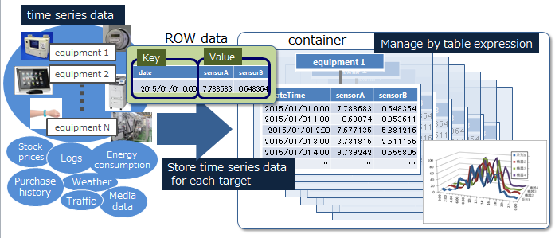
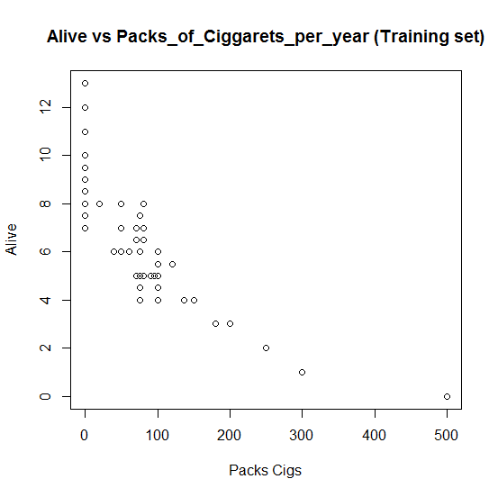
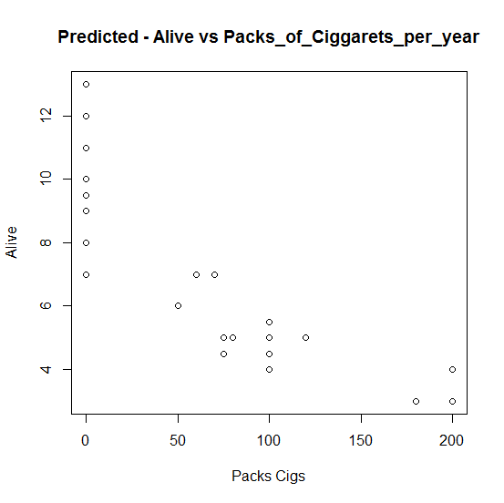

		 Machine Learning and Regression analysis of GridDB data, using R

**Introduction to GridDB.**

GridDB is an in-memory database, that allows a vast quantity of data to be stored and searched quickly and safely. 

GridDB is ideally suited for storing machine learning datasets because of its high performance, scalability and availability. GridDB can ingest petabytes of data quickly, handle diverse data formats easily and implements Key Container data model efficiently. 
Moreover, its in-memory processing coupled with parallel processing within a node and across nodes, ensures very fast query processing and  maximum performance. 

**Introduction to Machine Learning(ML)**  

Machine Learning is a subset of artificial intelligence which is concerned with developing algorithms that get smarter with time; they learn from their past data and past experiences,to perform better and to make more informed decisions.  
Data requirements in a ML project are demanding and specific. 
Machine learning projects require huge volumes of data, first to train the ML/AI models, and then to facilitate continuous learning as more and more data keeps flowing in.

**Why is GridDB ideally suited for AI/ML** 

GridDB is ideally suited for storing machine learning datasets because of its high performance, scalability and availability.  
GridDB can ingest petabytes of data quickly, handle diverse data formats easily and implements Key Container data model efficiently. 
Moreover, its in-memory processing coupled with parallel processing within a node and across nodes, ensures very fast query processing and  maximum performance. 

Since our topic of discussion is GridDb and its versatile capabilities, we will not delve deep into machine learning. 
Linear regression is one of the most popular Machine Learning algorithms, widely used for predictive analysis, finding correlation between variables and to uncover hidden relationships.   

**Introduction to R** 

R is a modern programming language, suitable for complex mathematical calculations, statistical analysis, creating charts and machine learning models. We chose R for our evaluations as R is gaining a lot of prominence in this era of big data analytics and machine learning.  

**What is Survival Analysis in ML** 

Survival Analysis is used to estimate the lifespan of a particular population under study. 
So, we try to predict the expected duration of time until an event like death of an organism OR stoppage( serious failure) in a mechanical system occurs. 
 It is also called 'Time to Event' Analysis as the goal is to estimate the time for an entity or a group to experience an event of interest.  

For conducting survival analysis, we create models that do complex calculations and predictions for us, and test them for accuracy. 
After some trial and error , once these models start giving good results they are put into production. 

**Our Data and its semantics**  

We use a publicly available dataset, which holds information about patients who underwent treatment for Hepatocellular Carcinoma, a type of cancer. 
This data holds indicators of their post-treatment lifestyle, like alcohol consumption, smoking, obesity etc. 
Also, many of their pathological/medical findings are there, like Arterial-Hypertension, Liver-Metastasis and Chronic-Renal-Insufficiency etc. 
Hepatocellular Carcinoma dataset (HCC dataset) 
Data Source-https://archive.ics.uci.edu/dataset/423/hcc+survival  

**Summary ( what are we doing in this blog)** 

We implement "Supervised Learning" in R with GridDB as the database. 
We try to find out co-morbid factors, i.e. factors or illnesses apart from the main ailment, that could be related or causal to a patient being dead or alive after treatment. 
Some of the data items we have, contain information about factors that are subjective and better understood by a trained medical professional. 
Hence, we will focus our study to more commonly understood terms like "Smoking" and "Diabetes". 
Below is a snippet about the same:-  
 

*Connect to GridDb via HTTPS connection ( Web API).*  

This method gives maximum flexibility and ease as you're not dependent on any driver or technology to connect to the database.  
You just use the simplest access methods via the secure Web API  

The GridDB URLs are of the form :-  **'https://[host]/griddb/v2/[clustername]/dbs/[databasename]'** ; where a cluster might be running multiple databases managed by a single  database server instance. 
In my case, my base url looks like this:- 
    baseurl = "https://cloud1.griddb.com/trialxxxx/griddb/v2/gsclustertrialxxxx/dbs/pratik"  

Lets first check if GridDb allows you a connection, we will check this via the checkConnection method of the Web API.  

    r <- GET(
	url = "https://cloud1.griddb.com/trialxxxx/griddb/v2/gsclustertrialxxxx/dbs/pratik/checkConnection" ,
     addheaders("Content-Type" = "application/json; charset=UTF-8" ) ,     
     config = authenticate("pratik", "MyPASS1234"), 
     encode = "json" 
      )

    print( r )  

If you see a "Status: 200" in the printed response, the server is ready to accept your connections. While we're checking the web based access, we also confirm that secure authenticated access via HTTPS is available , as we provide the username/password. 

 

To hold this data we must create a container(~table ) in GridDB. 
So, we send a POST request to the cluster with details of the container structure we need. 

    #Construct a data object to hold the request body (i.e., the container that needs to be created)

    my_data_obj = '{   	"container_name":"HCC_Data"  ,  	"container_type":"COLLECTION" ,    	"rowkey": false,    "columns": [  
    { { "name": "Gender"  ,"type": "FLOAT" },{ "name": "Symptoms"  ,"type": "FLOAT" },  { "name": "Alcohol"  ,"type": "FLOAT" },
    { "name": "Hepatitis B Surface Antigen"  ,"type": "FLOAT" },{ "name": "Hepatitis B e Antigen"  ,"type": "FLOAT" },{ "name": "Hepatitis B Core Antibody"  ,"type": "FLOAT" },{ "name": "Hepatitis C Virus Antibody"  ,"type": "FLOAT" },
    { "name": "Smoking"  ,"type": "FLOAT" },{ "name": "Diabetes"  ,"type": "FLOAT" }, { "name": "Obesity"  ,"type": "FLOAT" },{ "name": "Hemochromatosis"  ,"type": "FLOAT" }, { "name": "Arterial Hypertension"  ,"type": "FLOAT" },{ "name": "Chronic Renal Insufficiency"  ,"type": "FLOAT" },{ "name": "Nonalcoholic Steatohepatitis"  ,"type": "FLOAT" }, { "name": "Esophageal Varices"  ,"type": "FLOAT" },{ "name": "Splenomegaly"  ,"type": "FLOAT" },{ "name": "Liver Metastasis"  ,"type": "FLOAT" },  { "name": "Age at diagnosis"  ,"type": "FLOAT" },{ "name": "Packs of cigarets per year"  ,"type": "FLOAT" },{ "name": "Performance Status"  ,"type": "FLOAT" },
    { "name": "Encefalopathy	degree"  ,"type": "FLOAT" },{ "name": "Ascites degree"  ,"type": "FLOAT" }, { "name": "International Normalised Ratio"  ,"type": "FLOAT" },{ "name": "Alpha-Fetoprotein"  ,"type": "FLOAT" },
    { "name": "Haemoglobin"  ,"type": "FLOAT" },{ "name": "Mean Corpuscular Volume"  ,"type": "FLOAT" }, { "name": "Leukocytes"  ,"type": "FLOAT" },{ "name": "Platelets"  ,"type": "FLOAT" },
    { "name": "Albumin"  ,"type": "FLOAT" },{ "name": "Total Bilirubin"  ,"type": "FLOAT" }, { "name": "Alanine transaminase"  ,"type": "FLOAT" },{ "name": "Alkaline phosphatase"  ,"type": "FLOAT" }, { "name": "Total Proteins"  ,"type": "FLOAT" },{ "name": "Creatinine"  ,"type": "FLOAT" }, { "name": "Number of Nodules"  ,"type": "FLOAT" },{ "name": "Direct Bilirubin"  ,"type": "FLOAT" }, { "name": "Iron"  ,"type": "FLOAT" },{ "name": "Oxygen Saturation"  ,"type": "FLOAT" }, { "name": "Ferritin"  ,"type": "FLOAT" },{ "name": "Class"  ,"type": "FLOAT" }, { "name": "Alive"  ,"type": "FLOAT" } }  ] 
    }
  

    #Set up the GridDB WebAPI URL

    containerurl = baseurl + '/containers' 

    #Lets now invoke the POST request via GridDB WebAPI with the headers and the request body 

    r <- POST(containerurl, 
       addheaders("Content-Type" = "application/json; charset=UTF-8" ) ,    
       config = authenticate("pratik", "MyPASS1234"), 
       encode = "json", 
      data= mydataobj)

To check if the container was indeed created, you can use the "showcontainer" command, it will list all the containers in your database. 
Now lets define a function to insert data into the GridDB database. 
We use fromJSON() function of R, which reads a Json file, which can easily be fed to a POST Web API request. 

    # Populate the container with rows from JSON or CSV 
    hcc_data_JSON <- fromJSON(hcc_data.json)  
	

    insert_url = "https://cloud1.griddb.com/trial1602/griddb/v2/gs_clustertrial1602/dbs/r_blog/containers/HCC_Data/rows/"  
    r <- PUT(insert_url, add_headers("Content-Type" = "application/json; charset=UTF-8" ) , config = authenticate("pratik", "pratik"), encode = "json" , body=hcc_data_JSON ) 

    #To check if all rows have been inserted
     print(str(json.loads(r.text)['count']) + ' rows have been registered in the container HCC_Data.') 

We first use our "Training Data", to teach the model how life expectancy changes with number of packets of cigarettes smoked per year. 
Once our model is trained/taught, we expect it to take smarter decisions on its own. 
Later we will use this "training" , and ask the model to predict the life expectancy, given a new set of data.  

    #Fetch(Query) Only 2 columns are of interest, Alive( i.e. years alive after HCC) and Packs_of_cigarets_per_year (Packs of cigarretes per year) . 
     my_sql_query1 = '(f"""SELECT Packs_of_cigarets_per_year, Alive FROM HCC_Data """) '

    #To retrieve data from a GridDB container, the GridDB Web API Query URL must be suffixed with "/sql" 
     my_query_url = "https://cloud1.griddb.com/trial1602/griddb/v2/gs_clustertrial1602/dbs/r_blog/sql"

    #Construct the request body 
    query_request_body = '[ {"type" : "sql-select", "stmt" : "SELECT Packs_of_cigarets_per_year, Alive FROM HCC_Data" }]' 

    # print(query_request_body ) 
    #Invoke the GridDB WebAPI request 
    dataset <- POST ( my_query_url, 
       add_headers("Content-Type" = "application/json" ) ,      
       config = authenticate("pratik", "pratik"), 
       body = query_request_body 
       ) 
                             
    #The data returned is now in the dataset variable.  
	
	# Simple Linear Regression 
    # Splitting the dataset into the, Training_set and Test_set 
    split = sample.split(dataset$Packs_of_cigarets_per_year, SplitRatio = 0.7) 
    trainingset = subset(dataset, split == TRUE) 
    testset = subset(dataset, split == FALSE) 

    # Fitting Simple Linear Regression, to the Training set 
    lm.r = lm(formula = Packs_of_cigarets_per_year~Alive, data = trainingset) 
    # Just print the coefficient calculated, just to be sure that holds a logical value 
    coef(lm.r) 
  

Now lets visualize our results rather than discussing them subjectively. 
Visualization will show our findings clearly. 

    #Lets visualize the results. 
    trainingsetdf = data.frame( trainingset) 

    # Visualizing the Training set results  
    x <- trainingsetdf$Packs_of_cigarets_per_year 
    y <- trainingsetdf$Alive 
    plot(x, y, main="Alive vs Packs_of_cigarets_per_year (Training set)", xlab="Packs Cigs", ylab="Alive")

	
In our training set you can clearly see that life expectancy decreses drastically as Packs_of_cigarets_per_year increases above 100. 
In fact, you can clearly see 3 groups being formed:-  

**(i)** Less than 50 packs per year - stay alive more than 10 years 
**(ii)** Between 75-150 packs per year - stay alive close to 7 years 
**(iii)** More than 200 packs a year - do not stay alive for more than 3 years  or so 

**Notable findings and predictions :-** 
1. There is an indirect/inverse correlation between the number of packets of cigarettes smoked per year , and number of years alive (post operation) . 
As the volume of smoking increases , longevity decreases.  
2. There 
3. Since there are many other factors affecting the health of the patients in question, the curves are not smooth/steep, but the relation is evident. 
	

Now, let's try to predict the same using our Test-Data.  
We supply the test-data to our model, based on its "experience" the model will predict the life expectancy as per the newer input data.    

     # Predicting the Testset results based on a patient's lifestyle. 
     # "ypred" function calculates the predicted probabilities at the values of the explanatory(independent) variable.
     ypred = predict(lm.r, newdata = testset) 
     #Now, the data frame testset has the predicted values of life expectancy OR "Alive"(how long can one expect to stay alive based on post HCC treatment 
       lifestyle. 
	
	# Next, based on the training , let the algorithm now predict the life expectancy in years. 
     x <- testset$Packs_of_cigarets_per_year 
     y <- testset$Alive 
     plot(x, y, main="Predicted - Alive vs Packs_of_cigarets_per_year ", xlab="Packs Cigs", ylab="Alive") 

Above is the graph we get for our prediction 
    

We can assume that the predicted values are very good, as the graph we get for the predicted values clearly shows 3 different groups of points. 
So, our algorithm is able to remove the "noise"( i.e. the effect other co-morbid factors are inducing on longevity) , and clearly predict a range of life expectancy, based on the volume of smoking done. 

**To Conclude,** We have demonstrated the capabilities of GridDB, a fast in-memory database that lends itself well for not only fast querying but also analytics. 
GridDB can work with multiple languages and has data connectors for  most popular tools. Transitioning to GridDb is easy as it follows almost similar syntax as other database products. GridDB's fast query and analytics engine adds power and speed to your queries. 
GridDb's error messages are easy to understand, pin-pointed and give you a clear indication of where the trouble might be.  
